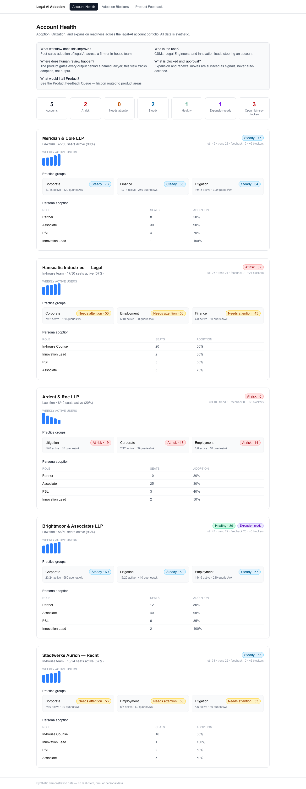
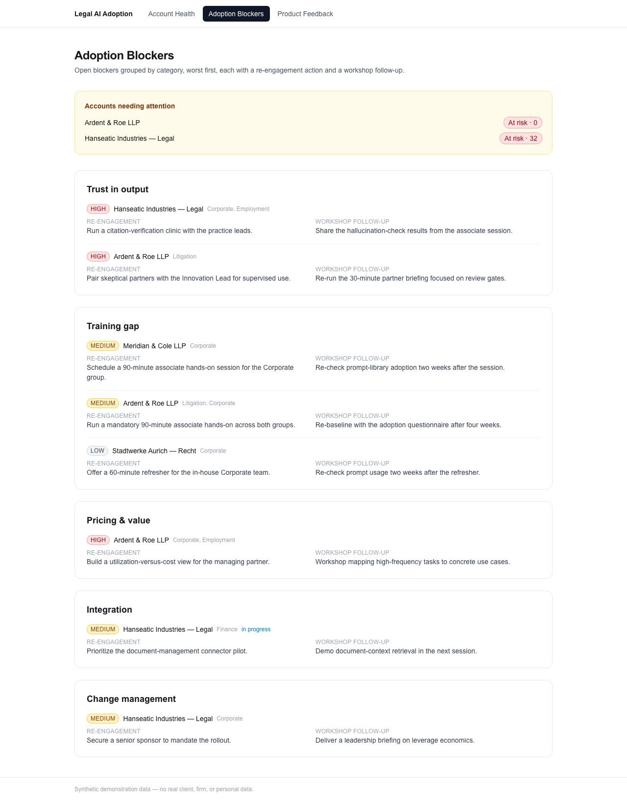
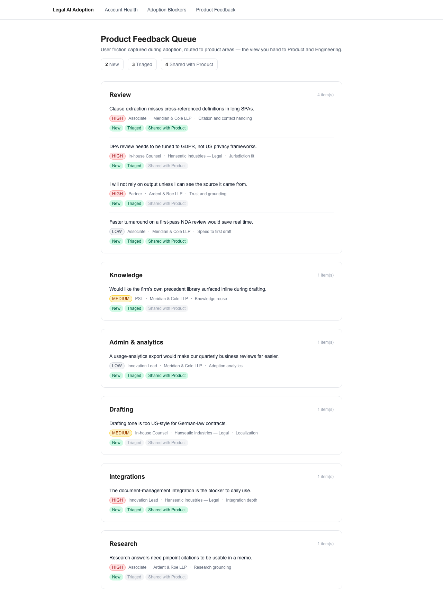

# Legal AI Adoption Dashboard

[](https://github.com/sebastianfoerste/legal-ai-adoption-dashboard/actions/workflows/ci.yml)

CI: passing. Deterministic test suite: 14 checks.

See [CASE_STUDY.md](CASE_STUDY.md) for the problem, controls, and limitations.


A mock dashboard for steering legal-AI adoption inside a law firm or in-house team.
It shows how a Customer Success Manager, Legal Engineer, or Innovation lead watches
adoption, catches accounts before they stall, and turns user friction into product
feedback. All data is synthetic.

**Public-safety posture:** synthetic account data only, source provenance for dashboard inputs, review-gated legal outputs, and no legal advice.

**Live demo:** https://legal-ai-adoption-dashboard.vercel.app

**Run locally:** `pnpm install && pnpm dev`.


> **What workflow does this improve?** Post-sales adoption of legal AI across a firm or in-house team.
> **Who is the user?** CSMs, Legal Engineers, and Innovation leads steering an account.
> **Where does human review happen?** The product gates every output behind a named lawyer. This dashboard tracks adoption, not output.
> **What is blocked until approval?** Expansion and renewal moves are surfaced as signals, never auto-actioned.
> **What would I tell Product?** See the Product Feedback Queue: friction routed to product areas.

## Pilot-to-adoption path

This is the Harvey / Legora reviewer path:

1. **Onboarding:** start in Account Health to see which teams are active, which practice groups are drifting, and which account is ready for expansion.
2. **Blocker diagnosis:** open Adoption Blockers to identify training gaps, workflow mismatch, stakeholder resistance, or missing precedent coverage.
3. **Workshop follow-up:** use the attached re-engagement action to book the right partner briefing, associate hands-on, or workflow discovery session.
4. **Product feedback:** route observed friction to the Product Feedback Queue with severity, product area, and customer impact.
5. **Usage trend:** return to weekly active usage and blocker status to decide whether adoption is improving or the account is at renewal risk.

## Problem

A legal-AI rollout does not fail at the demo. It fails three months later, when two
practice groups quietly stop logging in and nobody notices until renewal. The work of
adoption has no home: spotting the dip, naming the blocker, scheduling the right
workshop, and routing the right feedback to Product. This dashboard is that home.

## Target user

A Legal Engineer or CSM who owns a portfolio of firm and in-house accounts and is
measured on utilization, expansion, and renewal, not on shipping code.

## What this proves

- I model adoption as data: a health score over utilization, trend, blockers, and feedback engagement.
- I think in re-engagement, not dashboards for their own sake: every blocker carries an action and a workshop follow-up.
- I translate user friction into product requirements: the feedback queue is the artifact you hand to Product and Engineering.
- I make health legible: a portfolio overview strip for triage, and a per-account breakdown showing exactly what drives each score.
- I keep the human-review gate explicit: this tracks adoption of a reviewed product, never autonomous legal advice.

## Demo path

```bash
pnpm install
pnpm dev          # http://localhost:3000
pnpm test         # the adoption health score and data layer are unit-tested
```

Three pages:

1. **Account Health** (`/`): a portfolio overview strip (accounts by band, expansion-ready, open high-severity blockers), then per-account health with a score breakdown, practice groups, persona adoption, and the weekly-active trend.
2. **Adoption Blockers** (`/blockers`): open blockers by category, worst first, each with a re-engagement action and a workshop follow-up.
3. **Product Feedback Queue** (`/feedback`): user friction routed to product areas, with a triage pipeline.

## Screenshots

**Account Health**



**Adoption Blockers**



**Product Feedback Queue**



## Synthetic data statement

Every record in `data/` is synthetic and exists only for demonstration. No real client,
firm, or in-house team is represented; account names are invented. No personal data.
See [`data/README.md`](data/README.md).

## How a Legal Engineer would use this in a customer meeting

Open Account Health at the start of a quarterly review. The account sits at "Steady: 77"
with one open training-gap blocker in Corporate. You pull up Adoption Blockers, point to
the re-engagement action already attached, a 90-minute associate hands-on, and book it
on the spot. Then you open the Feedback Queue, show the partner that their associates'
complaint about cross-referenced definitions is already "Shared with Product," and use
that to make the renewal conversation about momentum instead of price. The overview strip
up top flags that one account in the book is already expansion-ready. That is the one you
build the upsell around this quarter.

## Limitations

- The health score is a deliberately simple, transparent formula (see `lib/health.ts`), not a tuned model.
- Practice-group health uses utilization and trend only; it has no group-level feedback signal, so a group never reads "healthy."
- Data is static JSON. There is no persistence, auth, or multi-tenancy. This is an MVP that demonstrates the workflow, not a product.

## Stack

Next.js (App Router, Server Components), TypeScript (strict), Tailwind, Zod for data
validation, Vitest for the logic tests.
